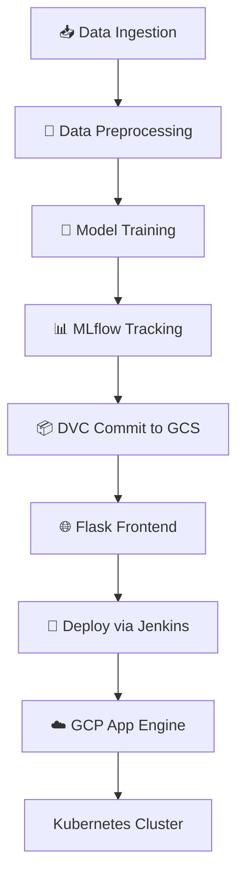

<<<<<<< HEAD
=======
<<<<<<< HEAD


# 🧠 ML Pipeline with DVC, MLflow, Jenkins & Flask Frontend

Welcome to this end-to-end machine learning project! This repository demonstrates a robust ML workflow with:

- 📦 Data Version Control (DVC) backed by Google Cloud Storage
- 📊 Experiment tracking via MLflow
- 🚀 CI/CD using Jenkins + GitHub
- 🌐 Flask-based frontend
- ☁️ Deployment to Google Cloud Platform (App Engine → Kubernetes)

---

## 📁 Project Structure

```
├── config/
│   ├── config.py         # Dataset feature columns
│   └── params.py         # Model hyperparameters
│
├── src/
│   ├── data_ingestion.py     # Load raw data
│   ├── data_preprocessing.py # Clean & transform data
│   ├── model_training.py     # Train & evaluate model
│   ├── logger.py             # Custom logging
│   ├── exception.py          # Error handling
│   └── utils.py              # Helper functions
│
│
├── app.py                      # Flask web app
│
├── dvc.yaml                  # DVC pipeline stages
├── mlflow_tracking/         # MLflow experiment logs
├── Jenkinsfile              # Jenkins pipeline config
└── README.md
```

---

## 🔁 Workflow Overview



---

## 🛠️ Tools & Technologies

| Tool         | Purpose                                |
|--------------|-----------------------------------------|
| **DVC**      | Version control for datasets & models   |
| **Google Cloud Storage** | Remote storage for DVC artifacts |
| **MLflow**   | Experiment tracking & model registry    |
| **Jenkins**  | CI/CD automation                        |
| **GitHub**   | Source control                          |
| **Flask**    | Lightweight frontend                    |
| **GCP App Engine** | Initial deployment target         |
| **GKE (Kubernetes)** | Scalable production deployment  |

---

## 🚀 Getting Started

### 1. 🔧 Setup Environment

```bash
git clone https://github.com/your-repo/ml-project.git
cd ml-project
python -m venv venv
source venv/bin/activate
pip install -r requirements.txt
```

### 2. 📦 Configure DVC with GCS

```bash
dvc remote add -d gcsremote gs://your-bucket-name
dvc remote modify gcsremote credentialpath ~/.gcp/credentials.json
```

### 3. 🧪 Run Pipeline

```bash
dvc repro
```

### 4. 📊 Track Experiments with MLflow

```bash
mlflow ui
# Visit http://localhost:5000 to view experiments
```

### 5. 🌐 Launch Flask App

```bash
cd frontend
python app.py
```

---

## ⚙️ CI/CD Pipeline (Jenkins + GitHub)

- ✅ Triggered on push to `main`
- 🧪 Runs tests and DVC pipeline
- 📦 Packages Flask app
- ☁️ Deploys to GCP App Engine
- 🔁 Later stages deploy to GKE

### Jenkinsfile Highlights

```groovy
pipeline {
    agent any
    stages {
        stage('Test') {
            steps {
                sh 'pytest'
            }
        }
        stage('DVC Repro') {
            steps {
                sh 'dvc repro'
            }
        }
        stage('Deploy to GCP') {
            steps {
                sh './deploy_to_gcp.sh'
            }
        }
    }
}
```

---

## 📈 MLflow Tracking

- Parameters, metrics, and artifacts are logged per run
- Models can be registered and versioned
- Supports comparison across experiments

---

## 🌍 Deployment Targets

| Stage        | Platform             | Purpose                     |
|--------------|----------------------|-----------------------------|
| **Stage 1**  | GCP App Engine       | Quick web deployment        |
| **Stage 2**  | GKE (Kubernetes)     | Scalable production hosting |

---

## 🧪 Testing

```bash
pytest src/tests/
```

---

## 🙌 Contributing

Pull requests are welcome! For major changes, please open an issue first to discuss what you'd like to change.

---

## 📜 License

[MIT](LICENSE)

---
=======
>>>>>>> 0be57d0 (Jenkins Dockerfile added)


# 🧠 ML Pipeline with DVC, MLflow, Jenkins & Flask Frontend

Welcome to this end-to-end machine learning project! This repository demonstrates a robust ML workflow with:

- 📦 Data Version Control (DVC) backed by Google Cloud Storage
- 📊 Experiment tracking via MLflow
- 🚀 CI/CD using Jenkins + GitHub
- 🌐 Flask-based frontend
- ☁️ Deployment to Google Cloud Platform (App Engine → Kubernetes)

---

## 📁 Project Structure

```
├── config/
│   ├── config.py         # Dataset feature columns
│   └── params.py         # Model hyperparameters
│
├── src/
│   ├── data_ingestion.py     # Load raw data
│   ├── data_preprocessing.py # Clean & transform data
│   ├── model_training.py     # Train & evaluate model
│   ├── logger.py             # Custom logging
│   ├── exception.py          # Error handling
│   └── utils.py              # Helper functions
│
│
├── app.py                      # Flask web app
│
├── dvc.yaml                  # DVC pipeline stages
├── mlflow_tracking/         # MLflow experiment logs
├── Jenkinsfile              # Jenkins pipeline config
└── README.md
```

---

## 🔁 Workflow Overview


---

## 🛠️ Tools & Technologies

| Tool         | Purpose                                |
|--------------|-----------------------------------------|
| **DVC**      | Version control for datasets & models   |
| **Google Cloud Storage** | Remote storage for DVC artifacts |
| **MLflow**   | Experiment tracking & model registry    |
| **Jenkins**  | CI/CD automation                        |
| **GitHub**   | Source control                          |
| **Flask**    | Lightweight frontend                    |
| **GCP App Engine** | Initial deployment target         |
| **GKE (Kubernetes)** | Scalable production deployment  |

---

## 🚀 Getting Started

### 1. 🔧 Setup Environment

```bash
git clone https://github.com/your-repo/ml-project.git
cd ml-project
python -m venv venv
source venv/bin/activate
pip install -r requirements.txt
```

### 2. 📦 Configure DVC with GCS

```bash
dvc remote add -d gcsremote gs://your-bucket-name
dvc remote modify gcsremote credentialpath ~/.gcp/credentials.json
```

### 3. 🧪 Run Pipeline

```bash
dvc repro
```

### 4. 📊 Track Experiments with MLflow

```bash
mlflow ui
# Visit http://localhost:5000 to view experiments
```

### 5. 🌐 Launch Flask App

```bash
cd frontend
python app.py
```

---

## ⚙️ CI/CD Pipeline (Jenkins + GitHub)

- ✅ Triggered on push to `main`
- 🧪 Runs tests and DVC pipeline
- 📦 Packages Flask app
- ☁️ Deploys to GCP App Engine
- 🔁 Later stages deploy to GKE

### Jenkinsfile Highlights

```groovy
pipeline {
    agent any
    stages {
        stage('Test') {
            steps {
                sh 'pytest'
            }
        }
        stage('DVC Repro') {
            steps {
                sh 'dvc repro'
            }
        }
        stage('Deploy to GCP') {
            steps {
                sh './deploy_to_gcp.sh'
            }
        }
    }
}
```

---

## 📈 MLflow Tracking

- Parameters, metrics, and artifacts are logged per run
- Models can be registered and versioned
- Supports comparison across experiments

---

## 🌍 Deployment Targets

| Stage        | Platform             | Purpose                     |
|--------------|----------------------|-----------------------------|
| **Stage 1**  | GCP App Engine       | Quick web deployment        |
| **Stage 2**  | GKE (Kubernetes)     | Scalable production hosting |

---

## 🧪 Testing

```bash
pytest src/tests/
```

---

## 🙌 Contributing

Pull requests are welcome! For major changes, please open an issue first to discuss what you'd like to change.

---

## 📜 License

[MIT](LICENSE)

---
<<<<<<< HEAD
=======
>>>>>>> 4ae36f8 (flask app added)
>>>>>>> 0be57d0 (Jenkins Dockerfile added)
